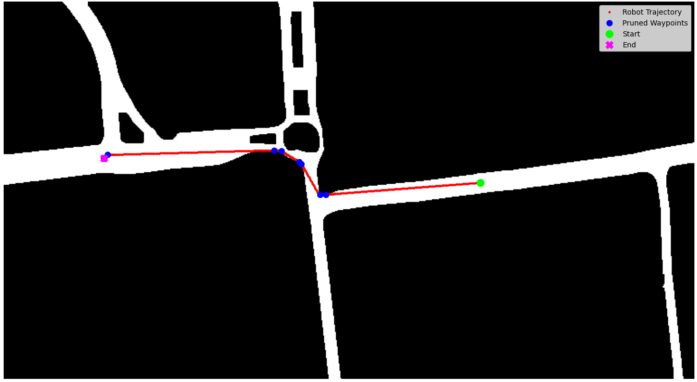
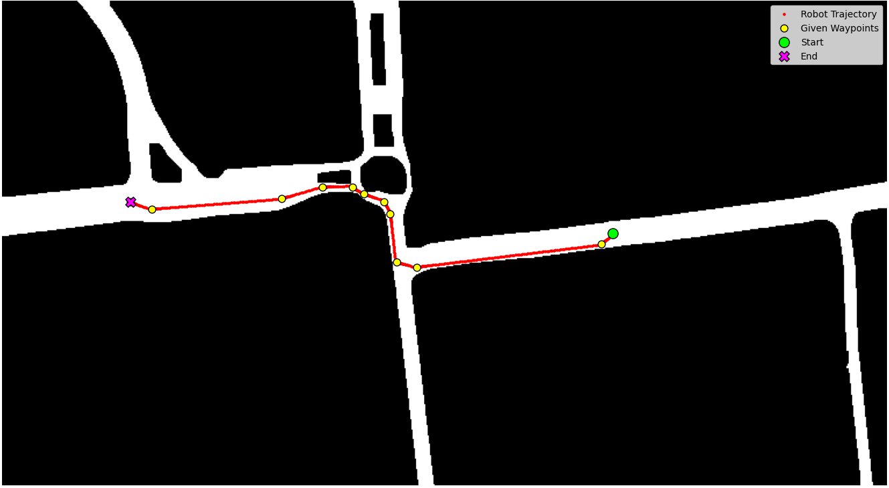
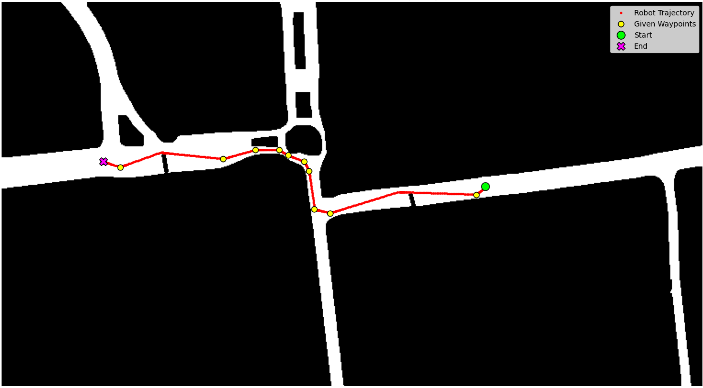

# Design and Simulation of a Mobile Robot

> This project involves the development of a mobile robot capable of operating on a specified route based on an image of a map. The system processes a static map to extract a drivable path, calculates the kinematics for a differential-drive robot, and utilizes a custom path planner to navigate the environment.

-----

## System Architecture

### 1\. Computer Vision Pipeline

The vision pipeline extracts the operational environment directly from a static map image.

  * The pipeline relies on the OpenCV library to process the map image.
  * It converts the original image into HSV and RGB colour spaces to extract masks for the road, the start marker, and the goal marker.
  * The color thresholds applied for mask extraction are as follows:

| Mask | Colour Space | Lower Threshold | Upper Threshold |
| :--- | :--- | :--- | :--- |
| Road (Grey) | HSV | [0, 0, 150] | [179, 50, 220] |
| Start (Red) | RGB | [150, 0, 0] | [255, 100, 100] |
| Goal (Green) | RGB | [50, 200, 0] | [180, 255, 100] |

  * Morphological closing operations utilizing a rectangular kernel fill in gaps and clean noise from the road mask.
  * A safety margin is applied using morphological erosion, uniformly shrinking the drivable area by a 2-pixel radius to prevent the robot from colliding with map boundaries.

### 2\. Robot Kinematics & Control
The system drives the navigation using standard differential-drive models. 
* The robot is configured with a wheel radius $r=0.25$, a half wheelbase $L=1.25$, and a total width of 2.5 pixels.
* A proportional velocity controller calculates the desired velocities based on the target coordinates.
* The controller features a turning gain of $8.0$ to prioritize rapid turns, and a standard forward driving gain of $1.0$.
* A cosine penalty is applied to the local velocity based on angular error, forcing the robot to slow down and turn rather than taking wide sweeping arcs off the road.
* The maximum forward velocity is strictly capped at $15.0$ pixels per second.

**Inverse Kinematics**
The inverse kinematics function calculates the required angular velocities for the two wheels, $\dot{\phi}_{1/2}$, to achieve a desired global velocity vector. 

First, a coordinate transformation from the global to the local space is calculated using the robot's current orientation:
$$R_{I\rightarrow0}=\begin{bmatrix}\cos(\theta)&\sin(\theta)&0\\ -\sin(\theta)&\cos(\theta)&0\\ 0&0&1\end{bmatrix}$$ 

This is then multiplied by the inverse kinematics matrix $J_{inv}$ to account for the physical constraints of the drive system:
$$J_{inv}=\begin{bmatrix}\frac{1}{r}&0&\frac{L}{r}\\ \frac{1}{r}&0&\frac{-L}{r}\end{bmatrix}$$

The complete mathematical operation to find the required wheel speeds is:
$$\begin{bmatrix}\dot{\phi}_{1}\\ \dot{\phi}_{2}\end{bmatrix}=J_{inv}R_{I\rightarrow0}\begin{bmatrix}v_{x}\\ v_{y}\\ \omega\end{bmatrix}$$ 

**Forward Kinematics**
The forward kinematics function performs the reverse mathematical operation, taking the applied wheel speeds to calculate the global velocities the robot achieved. 

The forward kinematics matrix $J_{fwd}$ is defined as:
$$J_{fwd}=\begin{bmatrix}\frac{r}{2}&\frac{r}{2}\\ 0&0\\ \frac{r}{2L}&\frac{-r}{2L}\end{bmatrix}$$ 

The complete matrix equation for this transformation, where $R_{0\rightarrow I}$ is the inverse of $R_{I\rightarrow0}$, is:
$$\begin{bmatrix}v_{x}\\ v_{y}\\ \omega\end{bmatrix}=R_{0\rightarrow1}J_{fwd}\begin{bmatrix}\phi_{1}\\ \phi_{2}\end{bmatrix}$$ 

**Position Update**
The robot's position is updated in discrete steps of $dt=0.1s$ using the standard formula:
$$x_{new}=x+(v_{x}dt)$$ 

### 3\. Path Planning

The planner operates directly in pixel-space to find a collision-free route.

  * A Dijkstra grid search algorithm operates directly on the binary road mask.
  * The algorithm evaluates an eight-connected grid, assigning a cost of 1.0 for orthogonal movements and 1.414 for diagonal movements.
  * To reduce the density of generated waypoints and prevent steering oscillations, a raycast pruning algorithm is applied.
  * This pruning method identifies the furthest reachable pixel via an unbroken line of sight and deletes all redundant intermediate waypoints.

-----

## Simulation Results

The project features three distinct simulation modes to test the planner and controller constraints:

**Point-to-Point Autonomous Navigation**

  * The robot successfully navigates from the start to the goal within the drivable constraints.
  * While highly efficient, the robot defaults to the absolute shortest path without adhering to implicit lane rules.

**Waypoint-Based Navigation**

  * Intermediate waypoints are manually introduced to enforce traffic rules.
  * The robot seamlessly links these waypoints, ensuring it drives on the correct side of the road while maintaining efficiency.

**Obstacle Avoidance**

  * Artificial barriers are introduced into the map to demonstrate the planner's dynamic capabilities.
  * The algorithm autonomously routes around obstructed paths while still successfully hitting all assigned waypoints.

-----

## Technologies Used

  * **Python**: Core programming language utilized via VS Code.
  * **OpenCV**: Executed all computer vision and mask extraction processes.
  * **NumPy & Matplotlib**: Handled mathematical operations and plotting.
  * **heapq**: Managed the priority queue for the Dijkstra search algorithm.
